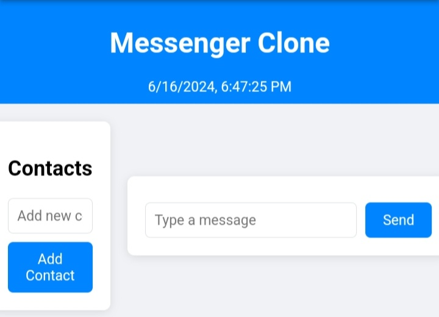

# Messenger Clone

A simple Messenger clone web application built with HTML, CSS, and JavaScript.

## Overview

This project is a Messenger clone that allows users to simulate messaging with contacts. It provides basic functionalities such as sending messages, unsending messages, copying messages, adding emojis, and auto-replying to messages. The application is designed to be simple and user-friendly, suitable for learning and practicing web development skills.

## Features

- **User Authentication:**
  - Login with username to access the messaging interface.
  -  

- **Messaging:**
  - Send messages to selected contacts.
  -  

- **Auto-Reply:**
  - Basic implementation of auto-reply feature for selected keywords.

- **Responsive Design:**
  - Ensures compatibility and usability across various devices and screen sizes.

### Explanation:

- **Overview**: Provides a brief introduction to the project and its purpose.
- **Features**: Lists key features of the Messenger clone application.
- **Demo**: Placeholder for including a GIF or a link to a live demo.
- **Technologies Used**: Lists the technologies and languages used in the project.
- **Setup Instructions**: Step-by-step guide to clone, setup, and run the project locally.
- **Usage**: Instructions on how to use the application once it's set up.
- **Contributing**: Guidelines for contributing to the project.
- **License**: Information about the project's license.

### Notes:

- Replace `your-username` in the clone command with your GitHub username or the repository URL.
- Include a screenshot (`screenshot.png`) or a GIF to showcase the application.
- Customize the content to match the specific features and details of your Messenger clone implementation.
- Add additional sections or details as needed based on your project requirements.

This `README.md` template provides a structured format to effectively communicate the details of your Messenger clone project on GitHub, making it easier for users to understand, use, and contribute to your project. Adjust it according to your project specifics and preferences.
